### Source Repo:

https://github.com/JunjiaWangUSF/devOpsSourceRepo

### Infrasturcue Repo:

https://github.com/JunjiaWangUSF/devOpsInfraRepo

### Abstraction

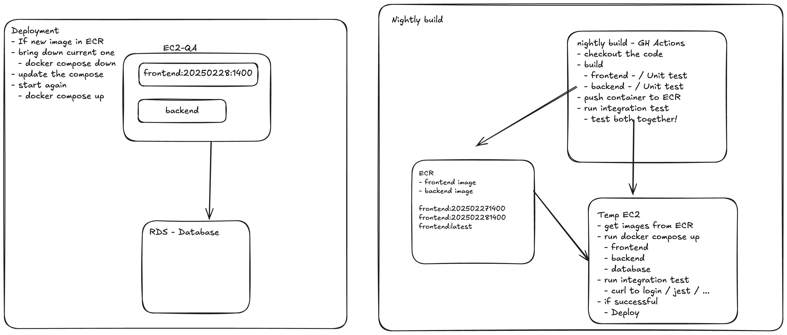
In this article, we will explore the process of building a small website, starting from local development and progressing to more complex deployment stages. Initially, we'll set up our development environment and create our website locally. Following this, we will implement a GitHub action and conduct connectivity tests to ensure that our Docker images are ready for further stages.

We'll then introduce a nightly build process to simulate a real-world daily software cycle, providing continuous integration and helping catch issues early. Once our application is ready, we will deploy it to an tempory Amazon EC2 instance to running a mock integration test. After integration test is passed, we will push images to a new repo and deploy our webiste. For web hosting, we'll use Nginx and integrate Route 53 for DNS management. We'll also secure a unique domain to give our website a professional touch. This approach offers a comprehensive overview of the website development lifecycle, from code creation to public release.

### Prerequisites

- Node
- Docker
- AWS account
- Domain name
- Github account
- AWS CLI

### Locally build - Source Repo

More repo deatil in later section, we can give a first look on our project:

```
Docker compose up
```

If you want to test seperately:

```
cd frontend
npm test
```

```
cd backend
node index.js
```

#### Running results

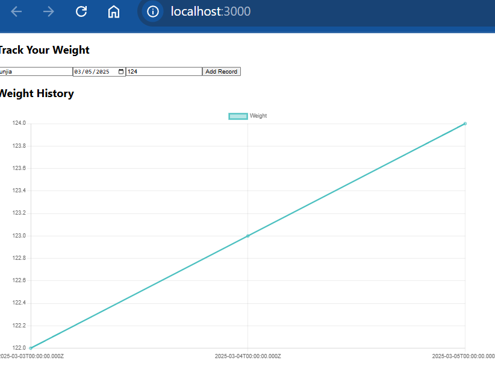

- This application can track users' weight by dates, key things to mentioned here, **each user can only have one weight data per day**

## Nightly build and push images to AWS ECR - Infrasturcue Repo

#### Dockerized our frontend and backend

backend: https://github.com/JunjiaWangUSF/devOpsInfraRepo/blob/main/backend/Dockerfile

frontend: https://github.com/JunjiaWangUSF/devOpsInfraRepo/blob/main/frontend/Dockerfile

docker compose file: https://github.com/JunjiaWangUSF/devOpsInfraRepo/blob/main/docker-compose.yml

- Insert a dummy data when database initialized: https://github.com/JunjiaWangUSF/devOpsInfraRepo/blob/main/mysql/init.sql
- frontend running on port: 3000
- backend running on port: 8000

example .env file: https://github.com/JunjiaWangUSF/devOpsInfraRepo/blob/main/example.env

Next, we will writing some tests to ensure our backend and Database connectivity.

test file: https://github.com/JunjiaWangUSF/devOpsSourceRepo/blob/main/backend/test/weights.test.js

- this test using Jtest to make real request to our backend server and backend will check response status and dummy data exist in our database.

---

**Important Note**: Since Docker operates on an isolated network, it's necessary to map the ports from the local machine to the container's ports. This ensures that requests to each endpoint can be properly directed and reached within the Docker environment. We also request a Mysql image on our locally testing enviroment, it is best practice to use envirment variables to connect our database, which can smooth switch between remote RDS and local DB.

---

## Github Action - Overivew

nightly-build: https://github.com/JunjiaWangUSF/devOpsInfraRepo/blob/main/.github/workflows/nightlybuild.yml

launch-ec2: https://github.com/JunjiaWangUSF/devOpsInfraRepo/blob/main/.github/workflows/launch-ec2.yml

Next, we need to set up the necessary GitHub Action secrets to securely store sensitive information required by our workflows. Here’s how to configure these secrets:

- Navigate to the GitHub Repository Settings: Go to the 'Settings' tab of your repository.

- Access the Secrets and Variables Section: Click on 'Secrets and Variables' to open the section where you can manage your repository secrets.

- Add New Repository Secret: Click on 'New repository secret' to begin adding each secret.

You'll need to configure the following secrets to ensure your GitHub Actions can interact with AWS services and your database securely:

- `AWS_ACCESS_KEY_ID`: Your AWS access key for API requests authentication.
- `AWS_ACCOUNT_ID`: The unique identifier of your AWS account.
- `AWS_REGION`: The AWS region your services are hosted in.
- `AWS_SECRET_ACCESS_KEY`: The secret key paired with your access key to authenticate requests.
- `AWS_SESSION_TOKEN`: A token required if you are using temporary credentials.
- `DB_DATABASE`: The name of your database.
- `DB_HOST`: The hostname or IP address of your database server.
- `DB_PASSWORD`: The password to connect to your database.
- `DB_PORT`: The port number your database service is listening on.
- `DB_USER`: The username used to connect to the database.
- `MYSQL_ROOT_PASSWORD`: The root password for MySQL, if applicable.

#### Github Action

Next, you'll need to log in to your AWS account. Once logged in, use the search bar to find and select ECR (Elastic Container Registry). Here, you should create four repositories; frontend, backend, frontend-host and backend-host.

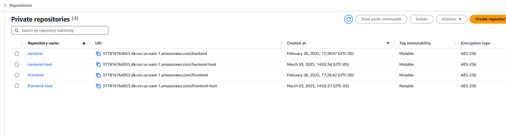

## Nightly Build GitHub Actions Workflow Overview

This GitHub Actions workflow is designed to automate the build, test, and deployment processes for a software project with both frontend and backend components. Here are the key steps involved:

##### **Trigger Events**

- **Schedule**: Executes daily at midnight.
- **Push**: Activates on any push to the `main` branch.

##### **Environment Setup**

- **Runner**: Utilizes Ubuntu-latest.
- **Initial Setup**: Checks out the code, sets up Docker Buildx, and installs Docker Compose.

##### **Service Initialization**

- **Docker Compose**: Starts up services using Docker Compose, with environment variables sourced from GitHub secrets for database connectivity.

##### **Operational Checks**

- **Readiness Check**: Ensures the MySQL database is ready for connections.
- **Service Status**: Checks and logs the status of Docker services.
- **Log Capture**: Captures and logs backend service output for diagnostics.

##### **Database Interaction**

- **SQL Query**: Executes a direct SQL query to verify database interaction.

##### **Testing**

- **Run Tests**: Executes tests within the backend service container to validate application functionality.

##### **AWS Configuration and ECR**

- **AWS Login**: Configures AWS credentials and logs into Amazon ECR.

##### **Image Building and Pushing**

- **Backend and Frontend**: Builds and pushes Docker images for both frontend and backend to Amazon ECR.

##### **Cleanup**

- **Resource Management**: Ensures all Docker containers are properly shut down and cleaned up post-execution.

If workflow runs correctly, you will see both fronend and backend images push to AWS ECR.

# Launch EC2 and Run Tests

This workflow is triggered by the completion of the "Nightly Build" workflow. It focuses on creating an EC2 instance, deploying the application using Docker Compose, running tests, and then cleaning up the environment.

##### Workflow Trigger

- **Trigger**: Triggered when the "Nightly Build" workflow completes successfully.

##### Jobs and Steps

### Job: Launch EC2 and Run Tests

- **Environment**: Runs on the latest Ubuntu server available on GitHub Actions.

#### Steps:

1. **Checkout Code**

   - Checks out the repository code to the runner.
   - **Action**: `actions/checkout@v2`

2. **List Repository Contents**

   - Lists all files in the repository for debugging purposes.
   - **Command**: `ls -R`

3. **Use Private Key**

   - Ensures the private key file has the correct permissions set.
   - **Command**: `chmod 400 xxxxx.pem`

4. **Configure AWS Credentials**

   - Configures AWS CLI with credentials provided via secrets.
   - **Action**: `aws-actions/configure-aws-credentials@v3`
   - **Inputs**:
     - `aws-access-key-id`: AWS access key ID (from secrets)
     - `aws-secret-access-key`: AWS secret access key (from secrets)
     - `aws-session-token`: AWS session token (from secrets)
     - `aws-region`: AWS region (from secrets)

5. **Create Temporary EC2 Instance**

   - Launches an EC2 instance using specified parameters.
   - **Command**: Multiple AWS CLI commands to run instances, check instance status, and get the public IP.

6. **Wait for EC2 Running**

   - Waits until the EC2 instance status is ok.
   - **Command**: `aws ec2 wait instance-status-ok`

7. **Transfer Docker Compose File and Script to EC2 Instance**

   - Transfers necessary Docker Compose and script files to the remote instance using `scp`.
   - **Command**: `scp` with options to skip host key checking.

   - **script.sh** it running our smoke test, if we recieved status code 200 than push our image to host repositories.
   - **docker-compose.yml** docker compose file for pull images from ECR

8. **Install Dependencies on EC2 Instance**

   - Connects to the EC2 instance and installs required software like Docker, Docker Compose, and AWS CLI.
   - **Commands**: A sequence of `ssh` commands executing remote commands on the EC2 instance.

9. **Make Script Executable and Run It**

   - Makes a shell script executable and runs it to execute application setup or tests.
   - **Command**: `ssh` to modify permissions and execute the script.

10. **Terminate Temporary EC2 Instance**
    - Terminates the EC2 instance after tests are completed to prevent ongoing charges.
    - **Command**: `aws ec2 terminate-instances`
    - **Cleanup Condition**: This step runs regardless of previous steps' success (`if: always()`).

This work flow is trigger by nightly build

### Create RDS Instance

Follow these steps to configure your Amazon RDS instance for MySQL:

1. **Access RDS**:

   - In the AWS Management Console, search for and select **RDS**.

2. **Choose MySQL**:

   - Select **MySQL** as the database engine.

3. **Select Free Tier**:

   - Opt for the **Free Tier** to manage costs.

4. **Deployment Type**:

   - Choose a **Single AZ (Availability Zone) instance deployment** for simplicity and cost savings.

5. **Management Type**:

   - Select **Self-managed** for full control over the database management.

6. **Set a Database Password**:

   - Ensure you provide a secure password for your database.

7. **Connect to an EC2 Compute Resource**:
   - Choose to connect to an EC2 compute resource. This ensures that your database and EC2 instance are in the same VPC (Virtual Private Cloud), facilitating secure and efficient communication. Please connect to QA EC2.

## Create QA EC2 Instance

Follow these steps to configure your Amazon EC2 instance:

1. **Access EC2**:

   - In the AWS Management Console, search for and select **EC2**.

2. **Create an Instance**:

   - Click on **Create Instance**.

3. **Select the Operating System**:

   - Choose **Amazon Linux** as the operating system.

4. **Key Pair Setup**:

   - Choose a key pair name. If you don’t have one, create a new key pair.

5. **Security Group Configuration**:

   - Create a new security group.

6. **Configure SSH Access**:

   - Set the security group rules to allow SSH traffic. You can allow access from anywhere or restrict it to your IP address for enhanced security.

7. **Elastic IP**:
   Next search for Elastic IP and allocate our EC2 a unchanged IP. This will hepl our DNS redirection in later steps.

---

**Important Note**: For the security group setting, we need to make sure prot 80, 443 and 22 open to your ip or anywhere.

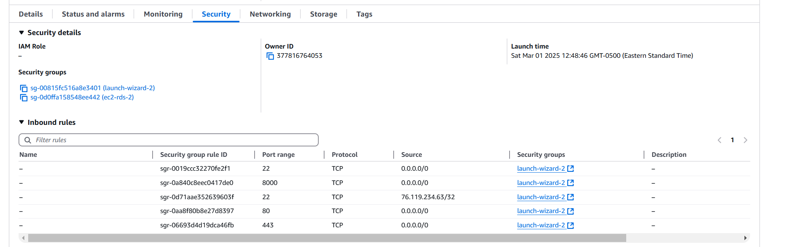

---

##### SSH EC2 Instance

In this step ensure AWS CLI is installed and add your aws_access_key_id and aws_secret_access_key under the ./aws/credentials

```
chmod 400 "yourkeypair.pem"

ssh -i "yourkeypair.pem" ec2-user@ec2-yourip.compute-1.amazonaws.com
```

Install AWS CLI in EC2 and also set config file under./aws/credentials

```
sudo yum install aws-cli -y
```

##### Install Docker

```
sudo amazon-linux-extras install docker
sudo service docker start
sudo usermod -a -G docker ec2-user
sudo curl -L "https://github.com/docker/compose/releases/download/v2.10.2/docker-compose-linux-x86_64" -o /usr/local/bin/docker-compose
sudo chmod +x /usr/local/bin/docker-compose
docker-compose version


```

#### Load AWS ECR login

aws ecr get-login-password --region us-east-1 | docker login --username AWS --password-stdin 377816764053.dkr.ecr.us-east-1.amazonaws.com

#### Explicitly pull the latest images

docker-compose pull

#### Start services with Docker Compose

docker-compose up -d

##### Install MySQL workbench

```
sudo dnf install mariadb105

mysql -u admin -p -h database-1.xxxxxxxxxx.us-east-1.rds.amazonaws.com // Your RDS end point
```

Execute init.sql file in repo, you will see dummy data exist in database.

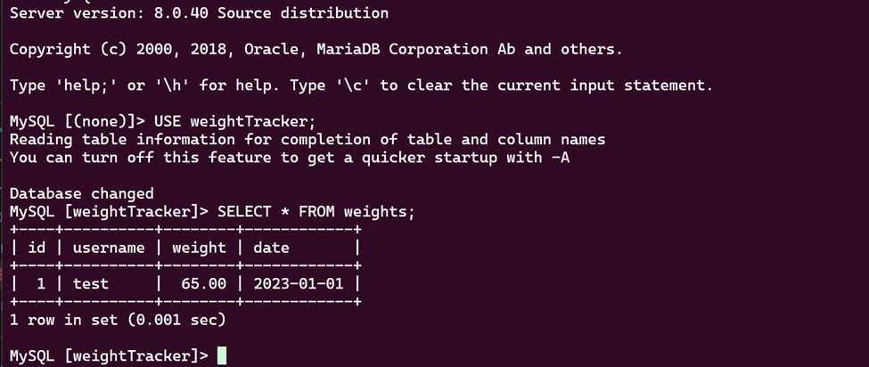

Login to ECR

```
aws ecr get-login-password --region us-east-1 | sudo docker login --username AWS --password-stdin 377816764053.dkr.ecr.us-east-1.amazonaws.com
```

Pull frontend images and check port is ready to accepct connection

```
sudo docker pull 377816764053.dkr.ecr.us-east-1.amazonaws.com/frontend-host:latest

```

```
sudo docker run -d -p 80:3000 377816764053.dkr.ecr.us-east-1.amazonaws.com/frontend-host:latest
```

**Note: We only set up frontend here**

Visit http://EC2IP, you will see frontend is running succefully.

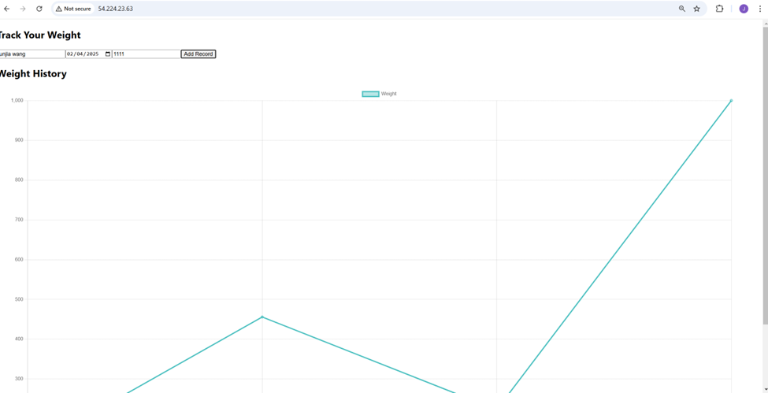

## Setting Up a Hosted Zone in AWS Route 53 for Your Custom Domain

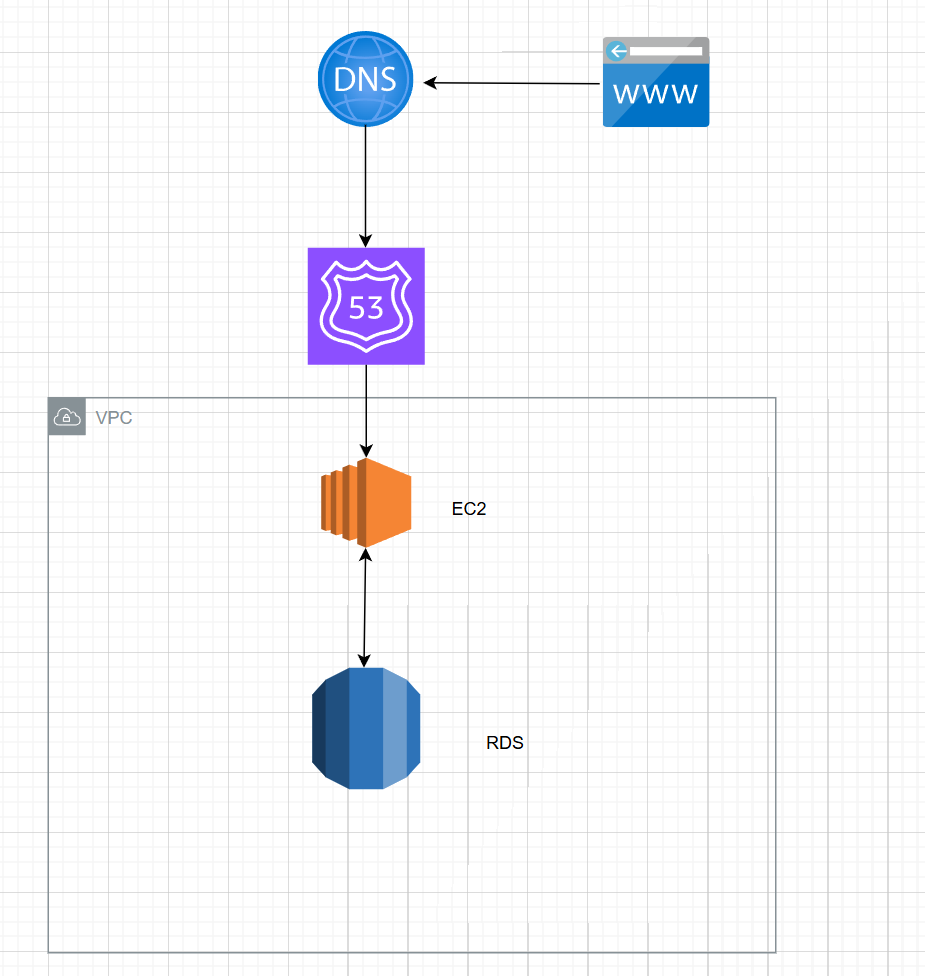
Follow these steps to configure AWS Route 53 to manage your domain's DNS and redirect traffic to an EC2 instance:

1. **Access Route 53**:

   - Navigate to the AWS Management Console and select **Route 53**.

2. **Create a Hosted Zone**:

   - Click on **Create Hosted Zone**.
   - Enter your custom domain name and follow the prompts to establish the zone.

3. **Update Your Domain's Name Servers**:

   - Upon creation, Route 53 will assign a set of DNS servers (NS records) to your hosted zone.
   - Copy these NS records and update the DNS settings on your domain registrar's site to point to these AWS name servers, delegating DNS management for your domain to AWS.

4. **Create an A Record**:
   - In the Route 53 hosted zone, add an A record.
   - Configure this A record to point to your EC2 instance’s public IP address.
   - This setup ensures that all traffic to your domain is directed to your EC2 server.

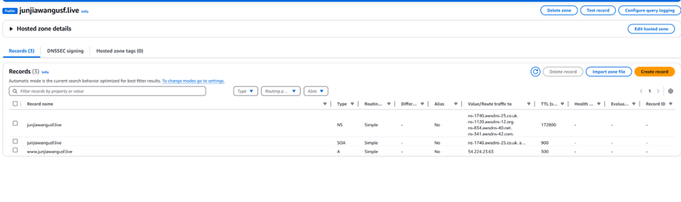
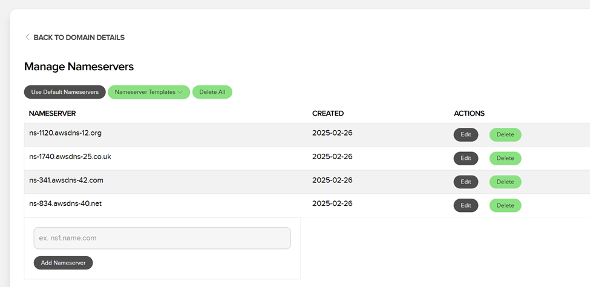

Wait few hours and enter your domain

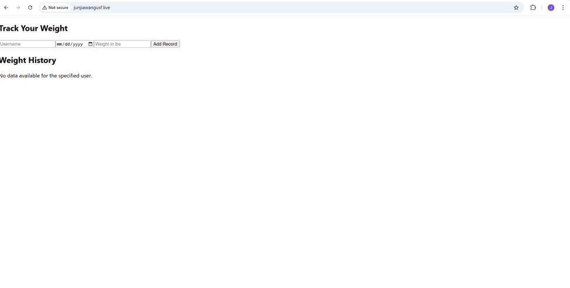

## Set up Nginx and serve our backend in reverse proxy

#### Installing and running Nginx

```
sudo yum install nginx -y
sudo systemctl start nginx
```

#### Install certbot

```
sudo yum install -y certbot python2-certbot-nginx
```

#### Selft sign SSL certificate

```
sudo certbot --nginx -d yourdomain  -d www.yourdomain

```

#### Set up Nginx configuration exmaple - the server as a reverse proxy for both your frontend and backend services.

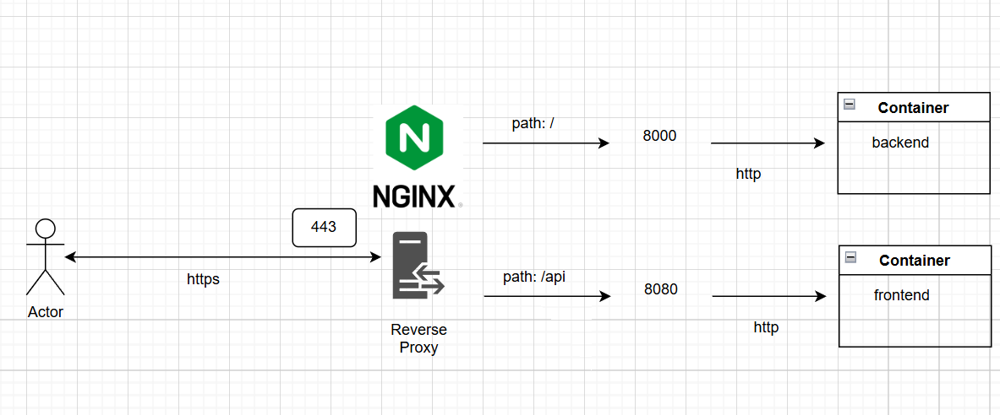

```
sudo vim /etc/nginx/conf.d/www.junjiawangusf.live.conf
```

```

server {
    server_name www.junjiawangusf.live;

    # Serve frontend
    location / {
        proxy_pass http://localhost:8080;  # Forward requests to your frontend on port 8080
        proxy_set_header Host $host;
        proxy_set_header X-Real-IP $remote_addr;
        proxy_set_header X-Forwarded-For $proxy_add_x_forwarded_for;
        proxy_set_header X-Forwarded-Proto $scheme;
    }

    # Serve backend API
    location /api/ {
        proxy_pass http://localhost:8000/;  # Forward requests to your backend on port 8000
        proxy_set_header Host $host;
        proxy_set_header X-Real-IP $remote_addr;
        proxy_set_header X-Forwarded-For $proxy_add_x_forwarded_for;
        proxy_set_header X-Forwarded-Proto $scheme;
    }

    listen 443 ssl; # managed by Certbot
    ssl_certificate /etc/letsencrypt/live/www.junjiawangusf.live/fullchain.pem; # managed by Certbot
    ssl_certificate_key /etc/letsencrypt/live/www.junjiawangusf.live/privkey.pem; # managed by Certbot
    include /etc/letsencrypt/options-ssl-nginx.conf; # managed by Certbot
    ssl_dhparam /etc/letsencrypt/ssl-dhparams.pem; # managed by Certbot
}

server {
    if ($host = www.junjiawangusf.live) {
        return 301 https://$host$request_uri;
    } # managed by Certbot

    listen 80;
    server_name www.junjiawangusf.live;
    return 404; # managed by Certbot
}
```

Restart Nginx

```
sudo systemctl reload nginx

```

#### Stop frontend container

```
docker ps
docker stop container id
```

#### Pull backend images and run frontend in different port

```
sudo docker run -d   -p 8000:8000   -e DB_HOST="database-1.cmkrqsxfvwur.us-east-1.rds.amazonaws.com"   -e DB_USER="admin"   -e DB_PASSWORD="password"   -e DB_DATABASE="weightTracker"   -e PORT=8000   377816764053.dkr.ecr.us-east-1.amazonaws.com/backend-host:latest

sudo docker run -d -p 8080:3000 377816764053.dkr.ecr.us-east-1.amazonaws.com/frontend-host:latest
```

---

**_Note:_**

1. Frontend Port Change: We now host our frontend on port 8080, instead of the standard port 80, because we've configured Nginx to handle the reverse proxy setup.

2. Nginx Configuration:

3. Root Access Redirection: Nginx is configured to listen on port 80. All requests to the root domain are redirected to port 8080 where the frontend is hosted.
   API Access: Any requests starting with /api are redirected to port 8000, where the backend services are running.
   Docker Image Handling with ECR:

4. Having previously logged into Amazon ECR, if a required Docker image is not found locally, Nginx will automatically search for it in ECR and pull it as needed

---

### Finally try our our website

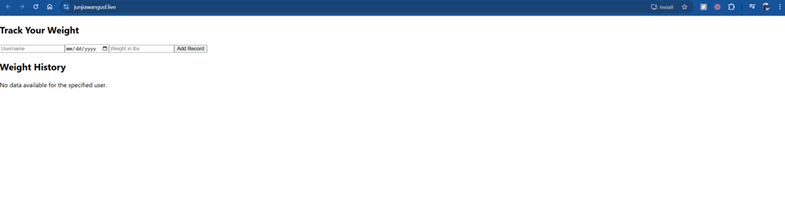
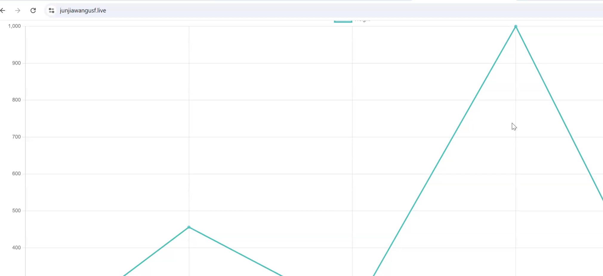
